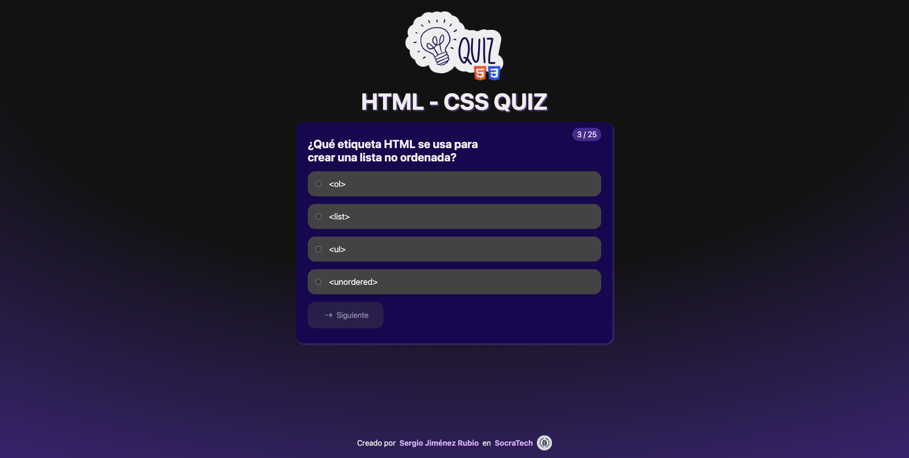

# Quiz de HTML y CSS

## Descripción

Este juego es un desafiante quiz diseñado para poner a prueba tus conocimientos en HTML y CSS, dos de los lenguajes fundamentales en el desarrollo web. Perfecto para principiantes que quieren evaluar su progreso o para desarrolladores experimentados que desean refrescar sus habilidades.

Características principales:

- Preguntas variadas que cubren desde conceptos básicos hasta avanzados de HTML y CSS.
- Interfaz intuitiva y fácil de usar.
- Retroalimentación inmediata después de cada respuesta.
- Puntuación final para medir tu rendimiento.

¡Pon a prueba tus habilidades en maquetación web y descubre cuánto sabes realmente sobre HTML y CSS!

## Descubre más sobre nosotros

